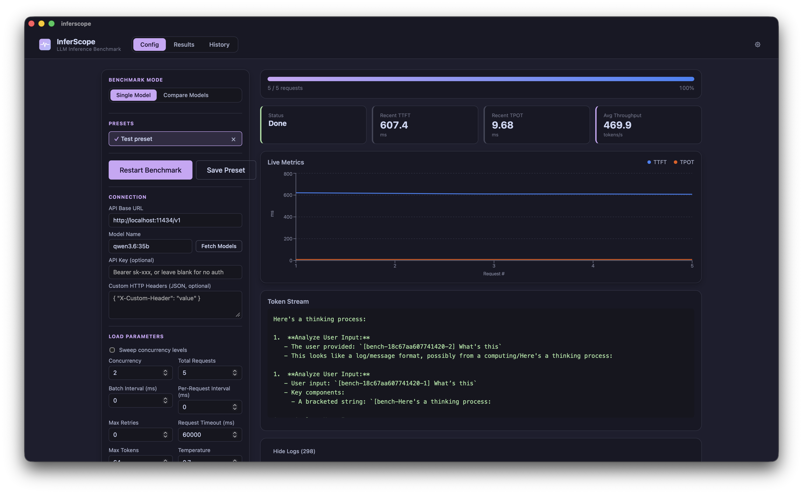
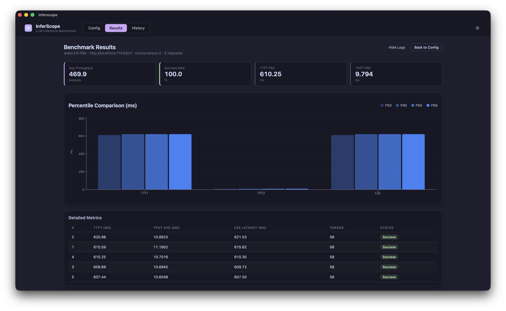
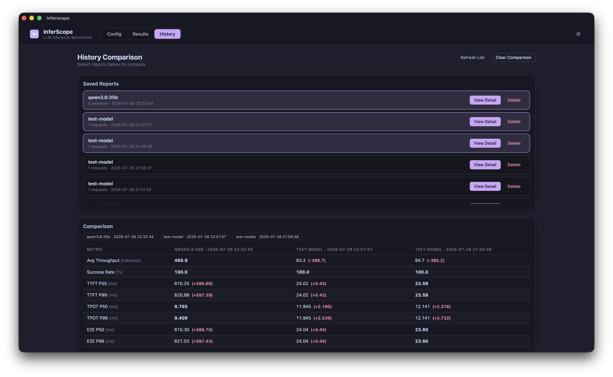

# InferScope

桌面 GUI 版 LLM 推理性能压测工具，类似 NVIDIA `genai-perf`，但带有图形界面。基于 [Tauri v2](https://tauri.app) + React + Rust 构建。

[English](./README.md)｜[简体中文](./README.zh-CN.md)


## 为什么做这个

压测 LLM 推理服务通常要么写一堆 `curl` 循环脚本，要么用命令行工具盯着终端看数字滚动。InferScope 提供的是一个真正的桌面应用：配置好参数、实时看着 token 一个个流式吐出来、跑完立刻拿到图表化的 P50/P90/P95/P99 百分位数据——全程不用离开图形界面。

## 截图

**配置页** —— 连接信息、压测参数与 Prompt 设置，运行中可实时看到 token 流和 TTFT/TPOT 曲线



**结果页** —— 百分位对比图表和逐请求明细表



**历史页** —— 浏览历史记录，任意多份报告并排对比差异



## 功能特性

**核心压测**
- 可配置并发数，按批次调度执行
- Token-by-token 实时流式输出，打字机效果展示生成过程
- TTFT/TPOT 实时折线图，随请求完成动态更新
- 完整性能报告：TTFT / TPOT / 端到端延迟的 P50/P90/P95/P99 百分位、平均吞吐量、成功率
- 每个请求自动注入**防缓存标记**，避免因重复发送相同 prompt 命中 KV cache 而得到失真的延迟数据
- 一次批量对比多个目标，每个目标可以各自设置 base URL / 模型 / API Key——不止能对比同一个服务下的不同模型，还能跨厂商对比，结果并排展示，每项指标自动高亮最优值
- 并发扫描：同一个模型依次跑一串逗号分隔的并发数，画出吞吐量-延迟曲线找饱和点

**请求配置**
- 支持 Bearer Token / 自定义 Authorization 头
- 任意自定义 HTTP 头（JSON 格式）
- 单轮或多轮（system/user/assistant）对话测试
- 从 `.txt` / `.jsonl` 批量导入 Prompt，逐请求循环使用
- 输入目标 token 数一键生成合成 Prompt（基于分词器，精确匹配 token 数），无需手写固定长度的测试文本
- 单轮模式下可附加一张本地图片，压测视觉模型
- 直接从目标服务拉取可用模型列表，不用盲填模型名

**容错与限流**
- 批次间延迟、请求间延迟（限流）
- 可配置最大重试次数，指数退避
- 压测中随时可以取消，进行中的请求会干净地终止

**报告与历史**
- 每次压测自动保存为 JSON 文件
- 浏览历史记录，可把任意一份加载回完整的结果页查看
- 任意多份历史报告并排对比，逐指标显示跟最优值的差距
- 通过系统原生文件对话框导出 JSON / CSV

**应用本身**
- 界面语言：English（默认）、简体中文、繁體中文
- 外观主题：浅色 / 深灰色 / 跟随系统
- 分级日志面板（Debug/Info/Warn/Error），支持搜索和导出
- 应用内检查更新（对接 GitHub Releases）

## 系统要求

- macOS 12+ / Windows 10+ / Linux（GTK3）
- [Rust](https://rustup.rs) 1.75+
- Node.js 18+ 和 [pnpm](https://pnpm.io) 8+

## 快速开始

```bash
# 安装依赖
pnpm install

# 开发模式运行
pnpm tauri dev

# 构建生产版安装包
pnpm tauri build
```

## 无头模式 / CI 集成

构建出来的可执行文件也可以不打开 GUI，直接跑一次压测，方便接入 CI 做性能回归检测：

```bash
# 跑一个配置文件，把完整报告以 JSON 形式打印到 stdout
inferscope bench --config bench.json

# 同时把报告写到文件
inferscope bench --config bench.json --output report.json

# 或者按名称跑应用里已保存的某个预设，而不是配置文件
inferscope bench --preset my-preset
```

`bench.json` 是一个 `BenchConfig` JSON 对象——字段说明见下面的[配置字段说明](#配置字段说明)。退出码只反映"这次压测本身有没有跑完"：配置文件读不出来/格式不对是 `2`，一个响应都没拿到是 `1`；哪怕成功率是 0%，只要拿到了报告，退出码依然是 `0`（成功率会体现在 JSON 里），具体要不要按指标判定阈值由外部脚本自己决定。跑的是和 GUI 完全相同的压测引擎，两边结果不会出现分歧。

## 配置字段说明

| 字段 | 类型 | 默认值 | 说明 |
|---|---|---|---|
| `base_url` | string | `http://localhost:11434/v1` | OpenAI 兼容 API 地址 |
| `model` | string | `qwen3.6:35b` | 测试模型名称 |
| `prompt` | string | — | 测试 Prompt（单轮对话模式） |
| `concurrency` | number | `2` | 并发请求数 |
| `num_requests` | number | `5` | 总请求数 |
| `max_tokens` | number | `64` | 最大输出 token 数 |
| `temperature` | number | `0.7` | 采样温度 |
| `auth_header` | string? | — | 如 `Bearer sk-xxx` |
| `custom_headers` | object? | — | 额外 HTTP 头（JSON） |
| `batch_interval_ms` | number | `0` | 批次间延迟（毫秒） |
| `per_request_interval_ms` | number | `0` | 请求间延迟（毫秒） |
| `max_retries` | number | `0` | 单请求最大重试次数 |
| `request_timeout_ms` | number | `60000` | 单请求超时时间（毫秒） |
| `messages` | Message[]? | `[]` | 多轮对话消息列表 |
| `image_data_url` | string? | — | 附加到单轮 prompt 的图片，data URI 格式（`data:image/png;base64,...`） |

## 输出指标

- **TTFT**（首字延迟）— P50/P90/P95/P99
- **TPOT**（单 token 生成耗时）— P50/P90/P95/P99
- **E2E Latency**（端到端延迟，从请求发起到流结束）— P50/P90/P95/P99
- **Throughput**（平均吞吐量，tokens/秒）
- **Success Rate**（成功率）

## 数据存储路径

| 类型 | 路径 |
|---|---|
| 已保存报告 | `~/.config/inferscope/.inferscope_reports/report_YYYYMMDD_HHMMSS.json` |
| 上次使用的配置 | `~/.config/inferscope/last_config.json` |
| 应用设置（语言/主题/日志级别） | `~/.config/inferscope/settings.json` |

*（以上路径基于 `dirs::config_dir()`，适用于 Linux/macOS；Windows 上对应 `%APPDATA%` 目录下。）*

## 常见问题

**如何测试 Ollama？**
把 Base URL 设为 `http://localhost:11434/v1`，填入你已经 `pull` 过的模型名（也可以点"获取模型"直接从列表里选）。

**如何测试需要 API Key 的服务？**
在"API 密钥"字段填入完整的认证头内容，比如 OpenAI 兼容服务用 `Bearer sk-xxx`，或按目标服务要求的格式填写。

**压测中报错 429？**
目标服务在限流。增大"批次间延迟"或"请求间延迟"，或者降低并发数。

**报告存在哪里？**
每次压测完成后自动保存，具体路径见上面的"数据存储路径"，也可以直接在"历史"页浏览。

**支持 Windows/Linux 吗？**
支持。在对应平台上执行 `pnpm tauri build` 会生成该平台的原生安装包。

## 参与贡献

欢迎提交 Issue 和 PR。提交改动前请确保：

```bash
cd src-tauri && cargo test && cargo clippy   # 要求零警告
npx tsc --noEmit
```

提交信息规范（Conventional Commits）见 [CONTRIBUTING.md](./CONTRIBUTING.md)，
版本号规则与发布流程见 [RELEASING.md](./RELEASING.md)（均为英文）。CI 会在每次
push / PR 时自动跑上述检查（`.github/workflows/ci.yml`）；推送 `vX.Y.Z` 格式的
tag 会自动构建 macOS/Windows/Linux 安装包并发布为 GitHub Draft Release
（`.github/workflows/release.yml`）。

## 许可证

[Apache License 2.0](./LICENSE)。第三方开源依赖的许可证归属信息见 [`THIRD-PARTY-NOTICES.md`](./THIRD-PARTY-NOTICES.md)。
